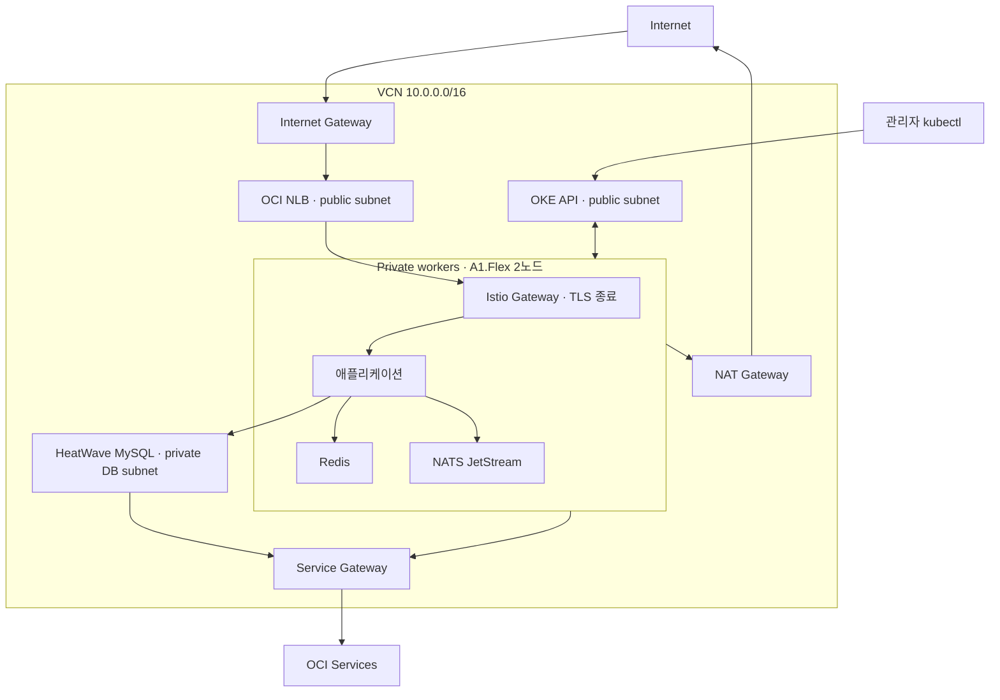

# OCI Kubernetes (Always Free)

OCI의 Always Free 혜택을 활용하도록 설계한 Kubernetes 플랫폼. Terraform으로 OKE와 네트워크·데이터베이스를 구성하고, Argo CD와 Jenkins로 플랫폼 및 애플리케이션 배포를 관리한다. 개발자가 서비스 개발에 집중할 수 있는 환경을 만드는 것이 목표다.

현재 Terraform은 **OKE Basic + ARM 워커 2개, 합계 4 OCPU / 24 GB**를 선언한다. 이 수치는 저장소의 구성값이며 현재 테넌트의 무료 한도나 실제 청구 금액을 뜻하지 않는다. 비용 확인 기준은 아래에 정리했다.

문서 기준일: **2026-09-28**. 아래 구성은 저장소의 Terraform·매니페스트를 기준으로 하며, 실행 중인 클러스터의 상태는 검증 명령으로 별도 확인한다.

## 저장소 역할

| 저장소 | 역할 |
| --- | --- |
| **oci-always-free-k8s** | OCI 인프라, Kubernetes 기반 구성, 플랫폼 컴포넌트, 부트스트랩 |
| [k8s-gitops](https://github.com/GGingGGang/k8s-gitops) | `auth`, `batch`, `core`, `notify`, `web`의 Application과 서비스 매니페스트 |
| [app-templates](https://github.com/GGingGGang/app-templates) | Go, Java(Gradle/Maven), Node.js/TypeScript, JavaScript/nginx, Python 서비스 생성기 |
| [jenkins-shared-library](https://github.com/GGingGGang/jenkins-shared-library) | `ci()` 파이프라인과 테스트·빌드·스캔·서명·GitOps 이미지 태그 갱신 |

서비스 소스 코드는 각 `svc-*` 저장소에 있고, 배포 매니페스트는 `k8s-gitops`가 관리한다. 이 저장소에서는 서비스 네임스페이스와 플랫폼 의존성을 준비한다.

## 현재 구성

| 계층 | 저장소에 정의된 구성 | 확인할 설정 |
| --- | --- | --- |
| IaC | Terraform `>= 1.12.0`, OCI provider `~> 6.0`, OCI Object Storage state backend | [provider.tf](./terraform/provider.tf), [main.tf](./terraform/main.tf) |
| Kubernetes | OKE Basic, Flannel Overlay, A1.Flex 2노드, Kubernetes 기본값 `v1.34.2` | [OKE 모듈](./terraform/modules/oke/main.tf), [variables.tf](./terraform/variables.tf) |
| 네트워크 | VCN, 4개 서브넷, Internet/NAT/Service Gateway, Security List, NSG | [networking](./terraform/modules/networking/main.tf), [iam](./terraform/modules/iam/main.tf) |
| 인입·TLS·DNS | OCI NLB, Istio Gateway, cert-manager DNS-01, Cloudflare external-dns | [infra 안내](./kubernetes/infra/README.md) |
| CI/CD | Jenkins JCasC, Kaniko, GHCR, Trivy, cosign, Argo CD | [Jenkins](./kubernetes/platform/jenkins/README.md), [Argo CD](./kubernetes/platform/argocd/README.md) |
| 보안 | 네임스페이스별 PSA, Istio ambient enrollment, Kyverno 서명 검증 `Enforce` | [네임스페이스](./kubernetes/infra/namespaces/namespaces.yaml), [이미지 정책](./kubernetes/platform/kyverno/policies/verify-image-signature.yaml) |
| 시크릿 | OpenBao Raft 1 replica, OCI KMS auto-unseal 설정, `emptyDir` 데이터 경로 | [OpenBao 설정](./kubernetes/platform/openbao/values.yaml) |
| 데이터 | HeatWave `MySQL.Free` 50 GB, Redis, NATS JetStream | [DB 모듈](./terraform/modules/database/main.tf), [Redis](./kubernetes/platform/redis/README.md), [NATS](./kubernetes/platform/nats/README.md) |
| 관측 | Prometheus, Grafana, Alertmanager의 Discord 수신자 설정 | [monitoring](./kubernetes/platform/monitoring/values.yaml), [알림 설정](./kubernetes/platform/monitoring/alertmanager-config.yaml) |
| 관리 접근 | Tailscale subnet router, 관리 UI의 public HTTPRoute 비활성화 | [Tailscale](./kubernetes/infra/tailscale/README.md) |

Istio ambient enrollment와 전역 `STRICT` 강제 정책은 구별한다. 현재 이 저장소에는 `PeerAuthentication`의 `STRICT` 정책이나 `AuthorizationPolicy` 매니페스트가 없다. Kyverno의 `mutateDigest`와 `verifyDigest`는 모두 `false`로, 서명 검증과 이미지 digest 고정도 구별한다.

Loki·Alloy·Tempo·Kiali, HPA·Prometheus Adapter, 자동 백업·복구, k6 부하 테스트는 현재 이 저장소에 배포 구성이 없는 후속 항목이다. `bao-snapshots` 버킷 선언만으로 OpenBao 자동 백업이 실행되는 것은 아니다.

## 아키텍처



일반 서비스 요청은 NLB에서 워커의 Istio Gateway로 전달된다. Kubernetes API endpoint는 클러스터 관리 경로이며 서비스 요청의 중계 지점이 아니다. 워커의 인터넷 egress는 NAT Gateway, OCI 서비스 접근은 Service Gateway를 사용한다. 워커와 DB 간 통신은 VCN 내부 경로다.

| 서브넷 | CIDR | 유형 | 용도 |
| --- | --- | --- | --- |
| `subnet-oke-api` | `10.0.0.0/28` | Public | Kubernetes API endpoint |
| `subnet-public` | `10.0.1.0/28` | Public | 서비스 인입 NLB |
| `subnet-workers` | `10.0.102.0/24` | Private | ARM 워커 노드 |
| `subnet-db` | `10.0.201.0/28` | Private | HeatWave MySQL |

공개 경로는 서비스의 `api.ggang.cloud/v1/auth`, `api.ggang.cloud/v1/core`, `www.ggang.cloud`와 Jenkins의 `ci-hook.ggang.cloud/github-webhook/`이다. 서비스 HTTPRoute는 `k8s-gitops`가, Jenkins webhook HTTPRoute는 이 저장소가 관리한다. Argo CD·Jenkins 관리 UI·Grafana의 public HTTPRoute는 주석 처리되어 있으며 tailnet 또는 port-forward로 접근한다.

## 배포 흐름

애플리케이션 CI는 `Test → Build & Push → Image Scan → Sign → Bump` 순서로 진행한다. 공유 라이브러리의 `deployBump`가 `k8s-gitops/main`에 이미지 태그 변경을 직접 push하고 Argo CD가 서비스별 네임스페이스로 동기화한다. 실제 배포 완료는 Jenkins 성공과 함께 Argo CD의 Sync·Health 상태 및 애플리케이션 상태를 확인한다.

플랫폼의 Application 구조는 다음과 같다.

```text
platform-root (이 저장소의 argocd/apps/*.yaml)
  ├─ 플랫폼별 Application → Helm chart / 이 저장소의 values·매니페스트
  ├─ platform-project → platform AppProject
  └─ app-layer-root → k8s-gitops/argocd/{project.yaml,root.yaml}
       └─ apps-root → auth / batch / core / notify / web
```

`platform-root`, `platform-project`, `app-layer-root`에는 `automated: {}`가 설정되어 있다. Jenkins·Prometheus 등 개별 플랫폼 Application에는 자동 sync가 설정되어 있지 않으므로 루트 동기화와 실제 플랫폼 배포를 구별해야 한다. 서비스 Application은 `k8s-gitops`의 자동 sync 정책을 따른다. 상세 설정은 [Argo CD Application 디렉터리](./kubernetes/platform/argocd/apps)를 확인한다.

## 리소스와 비용 확인

| 리소스 | 현재 선언값 | 확인할 점 |
| --- | --- | --- |
| A1.Flex | 노드당 2 OCPU / 12 GB, 2노드 | 총 4 OCPU / 24 GB의 테넌트별 무료 적용 범위 |
| OKE | `BASIC_CLUSTER`, managed node pool | 워커·스토리지·네트워크 사용량은 별도로 확인 |
| HeatWave | `MySQL.Free`, 데이터 50 GB | 홈 리전 가용성과 무료 적용 여부 |
| NLB | Istio Gateway가 생성하도록 지정 | 실제 생성 개수와 네트워크 사용량 |
| Block Volume | Prometheus 50 Gi + NATS 50 Gi PVC | 워커 부트 볼륨과 합산 |
| Object Storage | `bao-snapshots`, 별도 준비하는 `tfstate` 버킷 | 객체 크기·버전·요청 수 |
| KMS | Standard Vault, software-protected AES 키 | OpenBao auto-unseal용 |

Oracle Cloud Free Tier는 Always Free 서비스와 기간 한정 Free Trial을 포함한다. PAYG 계정에서도 무료 제공량을 넘는 사용은 과금 대상이다. [Oracle Free Tier 안내](https://www.oracle.com/cloud/free/)

2026-09-28 조회한 [Always Free 공식 문서](https://docs.oracle.com/en-us/iaas/Content/FreeTier/freetier_topic-Always_Free_Resources.htm)는 A1 무료량을 월 **1,500 OCPU-hour / 9,000 GB-hour**로 안내하고, Always Free tenancy 기준 **2 OCPU / 12 GB**로 설명한다. 이 저장소의 4 OCPU / 24 GB 설정을 그대로 무료라고 단정하지 않는다. 적용 전 해당 PAYG 테넌트의 무료 혜택·사용량·Cost Analysis를 확인한다. 이 README는 실제 청구 내역을 검증한 기록이 아니다.

기존 무료 리소스 카탈로그는 [한국어](./docs/summary-kr.md)와 [영어](./docs/summary.md)에 있다. 비용과 한도는 조회 시점의 공식 문서 및 테넌트 적용 조건을 우선한다. Basic과 Enhanced 기능 차이는 [Oracle 비교 문서](https://docs.oracle.com/en-us/iaas/Content/ContEng/Tasks/contengcomparingenhancedwithbasicclusters_topic.htm)를 참고한다. 이 프로젝트는 `BASIC_CLUSTER`와 `FLANNEL_OVERLAY`를 명시적으로 선택한다.

## 시작하기

아래 명령은 **저장소 루트에서 Linux Bash로 실행**한다. OCI 인증이 설정된 CLI, Terraform `>= 1.12.0`, kubectl, Helm이 필요하다. 프로비저닝과 Secret 준비는 각 컴포넌트 문서의 사전 조건을 따른다.

### OCI 인프라

처음 구성할 때 예제 파일을 복사하고 자신의 값으로 편집한다.

```bash
cp terraform/terraform.tfvars.example terraform/terraform.tfvars
cp terraform/backend.hcl.example terraform/backend.local.hcl
```

`terraform.tfvars`에는 OCI 인증·리전·compartment·SSH 공개키·DB 비밀번호·허용 CIDR을 입력한다. `backend.local.hcl`에는 Object Storage namespace·region·bucket·state key를 입력한다. state를 저장할 `tfstate` 버킷은 `terraform init` 전에 준비해야 한다. 생성 절차와 backend 인증은 [Terraform 안내](./terraform/README.md)를 따른다.

```bash
terraform -chdir=terraform init -backend-config=backend.local.hcl
terraform -chdir=terraform plan
terraform -chdir=terraform apply
```

### Kubernetes 접근

`OCI_REGION`은 Terraform에 입력한 리전과 같게 지정한다. OCI CLI 인증 프로필도 해당 테넌트를 가리켜야 한다.

```bash
export OCI_REGION='<your-region>'
oci ce cluster create-kubeconfig \
  --cluster-id "$(terraform -chdir=terraform output -raw oke_cluster_id)" \
  --file "$HOME/.kube/config" \
  --region "$OCI_REGION" \
  --token-version 2.0.0
kubectl get nodes -o wide
```

### 기반 구성과 플랫폼

기반 설치 순서는 `namespaces → Gateway API CRD → Istio 코어 → external-dns → cert-manager → Istio Gateway`다. 인증서 Secret이 준비된 뒤 HTTPS Gateway를 적용한다. metrics-server와 Tailscale 설치는 [infra 안내](./kubernetes/infra/README.md)를 따른다.

플랫폼 설치는 [platform 안내](./kubernetes/platform/README.md)와 컴포넌트별 README를 따른다. GitHub/GHCR 인증, Cloudflare 토큰, cosign 키, Grafana 자격증명, Discord webhook 등의 Secret을 먼저 준비한다. OpenBao의 KMS placeholder는 Terraform output으로 채워야 한다.

Argo CD 초기 설치와 self-managed 구성을 완료한 뒤 `platform-root`가 플랫폼 Application을, `app-layer-root`가 `k8s-gitops`의 진입점을 관리한다. OpenBao와 Tailscale은 현재 플랫폼 Application 목록에 없으므로 별도 설치 절차를 따른다.

### 서비스 온보딩

[app-templates](https://github.com/GGingGGang/app-templates)의 생성기로 서비스 소스와 GitOps 조각을 만든다. 공유 라이브러리의 `services.yaml` 등록, 서비스 네임스페이스, AppProject destination, GHCR pull Secret을 준비한다. DB가 필요한 서비스는 [운영 스크립트](./scripts/README.md)를 이용한다.

`onboard-app-db.sh`는 새 DB 사용자와 Secret을 만들 때, `onboard-app-grant.sh`는 기존 사용자의 추가 스키마 권한을 부여할 때 사용한다. 기존 사용자에 DB 생성 스크립트를 반복 실행하면 비밀번호와 Secret이 불일치할 수 있으므로 상세 문서를 먼저 확인한다.

## 운영 확인

```bash
kubectl get nodes -o wide
kubectl get applications -n cicd \
  -o custom-columns='NAME:.metadata.name,SYNC:.status.sync.status,HEALTH:.status.health.status'
kubectl get gateway public-gateway -n istio-system
kubectl get certificate -A
kubectl get pvc -A
kubectl get clusterpolicy verify-svc-image-signature
```

Prometheus와 NATS는 각각 50 Gi PVC를 요청한다. OpenBao는 `emptyDir` 기반 Raft이고 Redis와 Jenkins도 비영속 구성이므로, PVC 존재 여부와 각 컴포넌트의 데이터 복구 절차를 함께 확인한다. OpenBao의 KMS auto-unseal은 데이터 영속화나 백업을 대신하지 않는다.

## 디렉터리와 문서

| 경로 | 내용 |
| --- | --- |
| [terraform/](./terraform/README.md) | networking, oke, database, kms, iam, object-storage 모듈 |
| [kubernetes/infra/](./kubernetes/infra/README.md) | namespaces, Gateway API, Istio, DNS, TLS, metrics-server, RBAC, Tailscale |
| [kubernetes/platform/](./kubernetes/platform/README.md) | Argo CD, Jenkins, OpenBao, monitoring, Redis, NATS, Kyverno |
| [scripts/](./scripts/README.md) | 서비스 DB 생성과 추가 스키마 권한 부여 |
| `kubernetes/test/` | [네트워크](./kubernetes/test/networking/README.md), [스토리지](./kubernetes/test/storage/README.md), [DB](./kubernetes/test/database/README.md) 수동 검증 |
| [.github/workflows/](./.github/workflows) | Terraform fmt/validate, yamllint CI |
| [init.sh](./init.sh) | `ggang.cloud` 도메인을 다른 도메인으로 일괄 치환 |

## 변경 및 검증 규칙

- 비밀값은 Kubernetes Secret과 로컬 설정으로 전달한다. `.env`, `*.tfvars`, `*.local.*`, Terraform state, 개인키 등은 [.gitignore](./.gitignore) 기준으로 추적에서 제외한다.
- Helm의 실제 GitOps 배포 버전은 `argocd/apps/*.yaml`의 `targetRevision`을 따른다. 각 문서의 설치 예시에 나오는 버전 범위와 구별한다.
- 도메인 변경은 저장소 루트에서 `bash init.sh <new-domain>`으로 실행하고 결과 diff를 검토한다. 다른 저장소의 도메인과 외부 DNS·인증 설정은 별도로 맞춘다.
- Terraform CI는 fmt와 validate를, Kubernetes CI는 yamllint를 실행한다. 실제 apply, 클러스터 정상 동작, 복구 성공을 검증하는 작업은 포함하지 않는다.

아래 검증은 배포용 backend 작업 디렉터리와 분리된 새 checkout에서 실행한다.

```bash
terraform -chdir=terraform fmt -check -recursive -diff
terraform -chdir=terraform init -backend=false
terraform -chdir=terraform validate
yamllint --strict -c .yamllint.yaml kubernetes/
```

## 출처와 기준 시점

- 본 저장소: `a1abace` (2026-09-28)의 코드와 매니페스트. 각 구성표와 절차의 상대 링크가 근거 파일이다.
- 연결 저장소: `k8s-gitops`의 `c4c70e8`, `app-templates`의 `5cb5ad7` (각 2026-09-28), `jenkins-shared-library`의 `07682be` (2026-09-24)를 기준으로 구조와 CI 흐름을 확인했다.
- Oracle 외부 문서: 본문의 Free Tier, Always Free Resources, Basic/Enhanced 비교 문서를 2026-09-28에 조회했다. 페이지의 발행일은 명시되어 있지 않다. 비용 수치와 무료 적용 조건은 배포 시 다시 확인한다.
